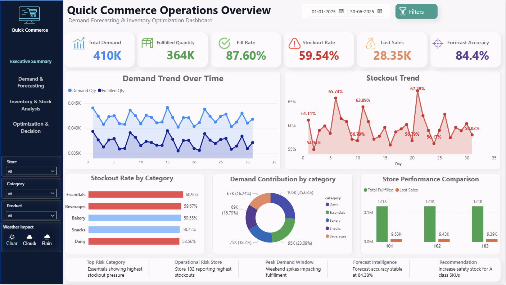
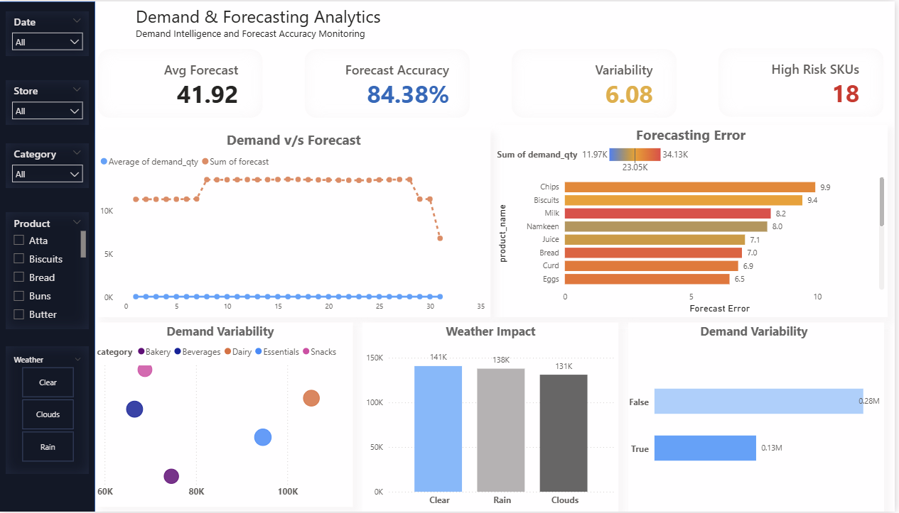
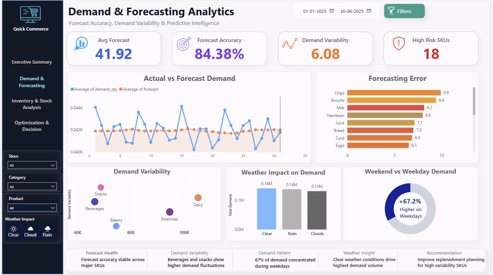
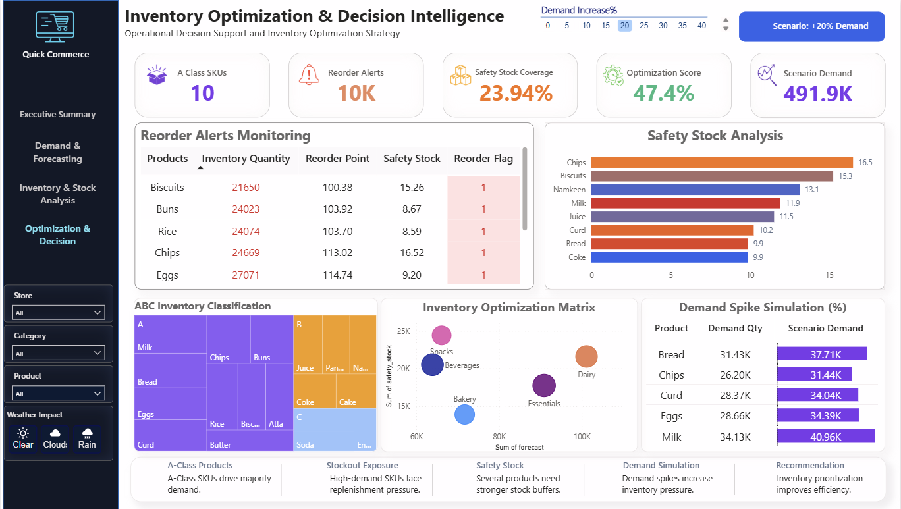

# Quick Commerce Inventory Optimization & Demand Intelligence System

## Project Overview

This project focuses on inventory optimization, demand forecasting, stockout analysis, replenishment intelligence, and operational KPI monitoring within a quick commerce environment using Python, SQL, and Power BI.

## Business Problem

Quick commerce businesses often experience operational challenges caused by inventory imbalance, unstable demand fluctuations, frequent stockouts, and inefficient replenishment planning.

This project was developed to improve forecasting visibility, reduce stockout exposure, optimize replenishment intelligence, and support operational decision-making using data analytics.

## Tools & Technologies

- Python
- Pandas
- NumPy
- SQL (MySQL)
- Power BI
- DAX
- Excel

## Dataset Overview

The project uses a simulated quick commerce operational dataset integrated with weather-based demand behavior.

Dataset includes:
- 3 operational stores
- 18 retail products
- inventory metrics
- fulfillment KPIs
- forecasting variables
- weather impact indicators
- replenishment intelligence variables

## Project Workflow

Data Generation  
↓  
Feature Engineering  
↓  
Demand Forecasting  
↓  
SQL KPI Analysis  
↓  
Power BI Dashboarding  
↓  
Inventory Optimization

## SQL Analysis

SQL was used to perform:
- operational KPI analysis
- stockout exposure analysis
- category performance evaluation
- forecasting validation
- replenishment analysis
- inventory risk monitoring

## Python Analytics

Python workflows were implemented for:
- dataset simulation
- feature engineering
- rolling demand forecasting
- ABC inventory analysis
- safety stock modeling
- reorder point optimization

## Dashboard Overview

### Executive KPI Dashboard



### Demand Forecasting Dashboard



### Inventory Risk Dashboard



### Inventory Optimization Dashboard



## Key Operational KPIs

| KPI | Value |
|------|------|
| Total Demand | 409,879 |
| Fulfilled Quantity | 363,823 |
| Fill Rate | 87.60% |
| SKU-Level Stockout Exposure | 59.54% |
| Lost Sales | 28,349 |
| Forecast Accuracy | 84.38% |
| Optimization Score | 47.4% |

## Key Business Findings

- Essentials category contributed the highest lost sales exposure.
- Beverages recorded the lowest fill rate performance.
- High-demand products experienced repeated stockout pressure.
- Forecast instability was concentrated among fast-moving SKUs.
- Inventory optimization analysis identified replenishment-sensitive products during demand spikes.

## Recommendations

- Improve safety stock coverage for high-risk products.
- Strengthen replenishment planning for volatile SKUs.
- Monitor weekend demand spikes separately.
- Improve forecasting visibility across product categories.
- Reduce lost sales exposure through proactive inventory monitoring.

## Repository Structure

```text
quick-commerce-inventory-optimization/

├── data/
├── sql/
├── python/
├── powerbi/
├── documentation/
├── presentation/
├── images/
└── screenshots/


---

# 🚀 STEP 15 — ADD HOW TO RUN

Paste:

```markdown id="rdm17"
## How to Run

1. Clone the repository
2. Install required libraries from requirements.txt
3. Run Python scripts sequentially
4. Import dataset into MySQL
5. Open Power BI dashboard file


